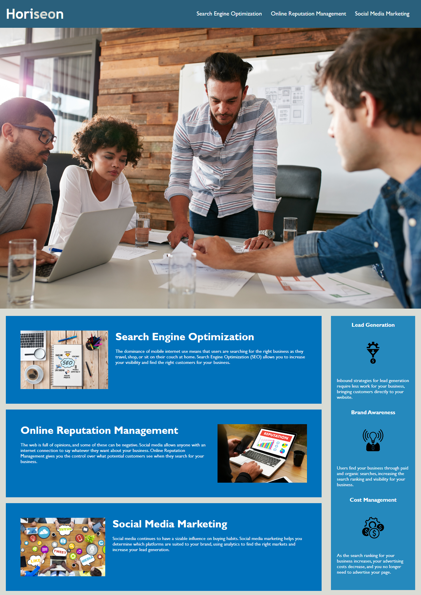

# Challenge 1: Horiseon Webpage

## Description

This webpage is for the marketing agency "Horiseon."
It contains a codebase that includes accessibility standards 
in order for a more optimized search engine experience. 

Code uses HTML and CSS. 

## Webpage

URL : https://erech.github.io/Horiseon-Webpage/

## Credits
Starter Code provided by Xandromus from GitHub

## License 

N/A
